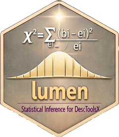

# 📦 lumen 

<!-- badges: start -->
[](https://CRAN.R-project.org/package=lumen)
[](https://www.gnu.org/licenses/old-licenses/gpl-2.0.html)
<!-- badges: end -->

**Title:** Statistical Tests, Confidence Intervals, and Distributions\
**License:** GPL (≥ 2)

## 🧩 Overview

`lumen` is the inferential layer of the **DescToolsX ecosystem**. It
provides classical, robust, nonparametric and specialised hypothesis
tests, confidence intervals for the common estimands, and a set of
probability distributions that base R does not carry.

Tests return ordinary `"htest"` objects and intervals follow one
argument convention throughout, so procedures from very different
literatures can be combined without translating between interfaces.

The package is self-contained and does not require the higher-level
packages of the suite.

📖 **Documentation:** <https://andrisignorell.github.io/lumen/>

## ⚙️ Installation

``` r
install.packages("lumen")
```

Or the development version from GitHub:

``` r
remotes::install_github("AndriSignorell/lumen")
```

## 📚 Core Features

### 🔹 Location Tests

-   `tTestA()`, `zTest()`, `yuenTTest()`, `signTest()`
-   `brunnerMunzelTest()`, `siegelTukeyTest()`, `mosesTest()`
-   `moodMedianTest()`, `vanWaerdenTest()`, `dscfTest()`

### 🔹 Categorical Data

-   `barnardTest()`, `gTest()`, `cochranArmitageTest()`,
    `cochranQTest()`
-   `breslowDayTest()`, `woolfTest()`, `mantelTrendTest()`
-   `bhapkarTest()`, `stuartMaxwellTest()`, `lehmacherTest()`

### 🔹 Goodness of Fit and Normality

-   `andersonDarlingTest()`, `cramerVonMisesTest()`, `lillieTest()`
-   `shapiroFranciaTest()`, `jarqueBeraTest()`, `pearsonTest()`
-   `hosmerLemeshowTest()`, `leCessieTest()` — for logistic models

### 🔹 Multiple Comparisons and Post-hoc

-   `postHoc()`, `plot.PostHocTest()`
-   `dunnTest()`, `dunnettTest()`, `conoverTest()`, `nemenyiTest()`
-   `gamesHowellTest()`, `scheffeTest()`, `steelTest()`

### 🔹 Trend, Randomness and Time Series

-   `adfTest()`, `kpssTest()`, `runsTest()`, `vonNeumannTest()`
-   `bartelsRankTest()`, `coxStuartTest()`, `jonckheereTerpstraTest()`
-   `pageTest()`, `durbinWatsonTest()`, `breuschGodfreyTest()`,
    `bpTest()`

### 🔹 Confidence Intervals

-   Proportions: `binomCI()`, `binomDiffCI()`, `binomRatioCI()`,
    `multinomCI()`
-   Counts and rates: `poissonCI()`, `poissonDiffCI()`,
    `poissonRatioCI()`
-   Location and scale: `meanCI()`, `meanDiffCI()`, `medianCI()`,
    `quantileCI()`, `varCI()`, `sumCI()`
-   Correlation: `corCI()`, `fisherZ()`
-   General: `bootCI()` for arbitrary statistics

### 🔹 Distributions

`dpqr` families for the Benford, Dirichlet, extreme value, Fréchet, GEV,
GPD, Gompertz, Gumbel, reversed Gumbel, order-statistic, reverse Weibull
and triangular distributions, plus `cont.moments()`, `disc.moments()`
and `extreme-value-moments()`.

### 🔹 Power and Sample Size

-   `meanCIn()`, `powerChisqTest()`, `sphericityEps()`, `scores()`

## 🚀 Design Principles

-   **Consistent** — lowerCamelCase API, uniform argument names and
    ordering across the whole DescToolsX suite
-   **Standard output** — tests return `"htest"` objects and print like
    the ones in base R
-   **Fast** — bootstrap and permutation routines implemented in C++ via
    Rcpp, RcppArmadillo and RcppParallel
-   **Documented** — references to the original literature on every
    procedure

## 🧪 Example

``` r
library(lumen)

# a confidence interval for a proportion, several methods
binomCI(37, 100, method = "wilson")

# nonparametric alternative to the t test
brunnerMunzelTest(extra ~ group, data = sleep)

# post-hoc comparisons after an ANOVA
fit <- aov(breaks ~ tension, data = warpbreaks)
postHoc(fit, method = "hsd")

# goodness of fit
andersonDarlingTest(rnorm(100), null = "pnorm")
```

## 🧱 The Suite

`lumen` builds on `bedrock` (base utilities) and `pharos` (graphics).
`DescToolsX` (descriptive statistics), `alloy` (modelling), `pons`
(MS-Office) and `swissValet` (RStudio addins) complete the family.

## 🙏 Acknowledgements

Parts of the code and documentation were reviewed with the help of large
language models (OpenAI Codex, Anthropic Claude). Every suggestion was
assessed, edited and verified by the maintainer, who remains solely
responsible for the content of this package.

## 📜 License

GPL (≥ 2)
